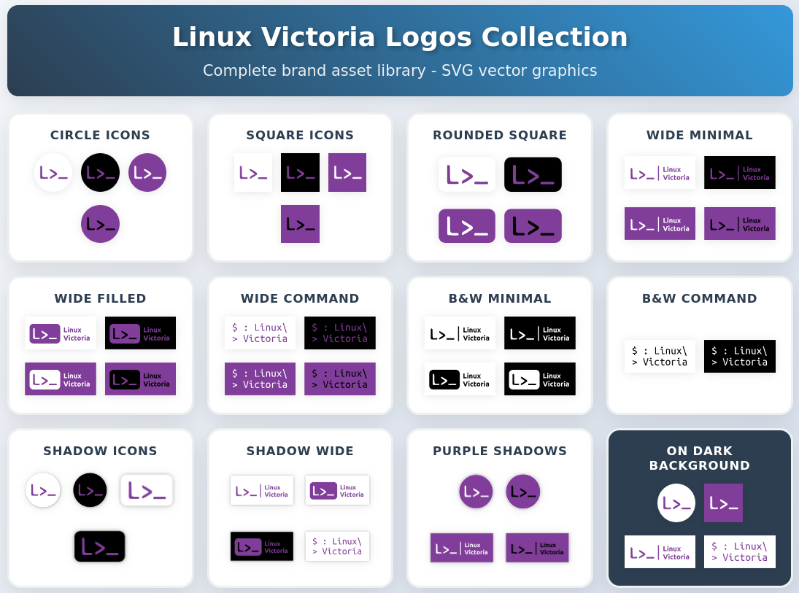

# Linux Victoria Brand Logos

A collection of Linux Victoria brand logos in various styles, colors, and layouts. Includes icon, minimal, and wide-format versions for use across light and dark backgrounds.

## 📁 Structure

- `Logo_Icon/` – Circular, square, and rounded-square icons
- `Logo_Wide_Min/` – Minimal wide logo versions
- `Logo_Wide_Filled/` – Full wide logo versions
- `Logo_Wide_Command/` – Command-line themed wide logos
- `Drop_Shadow/` – Variants with drop shadows for use on flat backgrounds

## 🎨 Formats

- `.svg` – Recommended for most use cases (vector, scalable)
- `.png` – Use for raster or platform-specific needs (social media, etc.)

## ✅ Tips for Use

- **Profile Pictures / Icons:** Use `Icon_` variants. Double-check that the logo isn't cropped awkwardly on circular or square platforms.
- **Light vs. Dark:** Choose logo color schemes that match the background for visibility.
- **Print or Large Display:** Use `.svg` files for sharp rendering at any size.
